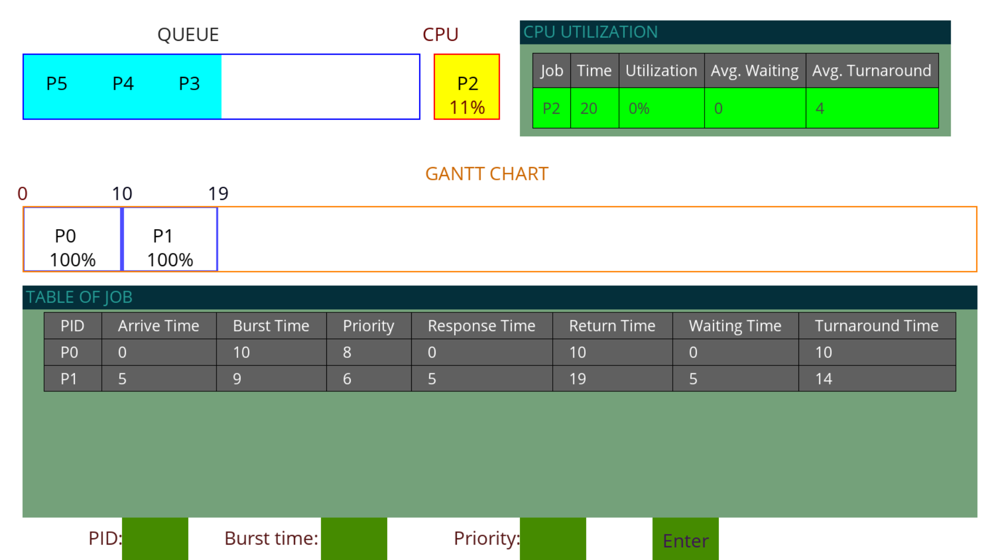

CPU Scheduling Algorithm Simulator
==================================
*Hello, this is a project for our subject at school, and we are:* <br>
1. **Thịnh**: people said I am the leader of this project, but I prefer to be a server, a server found his happiness in his work
2. **Nhật**: a gentle and kind guy, I think we have the same frequency, because we catch on each other pretty fast
3. **Đạt**: a mysterious and very kind guy, mysterious thing because he rarely appear at class ;D
## We use Python to simulate CPU Schedulers works using GUI
**This source code has**: *First come first serve (FCFS)*, *Shortest Job First (SJF)*, *Round Robin (RR)* and *Preemptive priority (PPS)* <br>
*A little more details abour the algorithms*: with **SJF**, we use non-preemptive, **RR** of course it needs preemptive thing, for **PPS**, we update the priority of every process base on their waiting time. 
## What does the code can do?:

Above is the picture of the GUI of the program, it has 6 main parts: <br>
1. Ready Queue: This block will show the process when it comes to ready queue (base on it's arrival time that we set up or we add process in real time)
2. CPU: This block shows the process which is executing in CPU and the percent of completement
3. CPU utilization: Like the name, it shows utilization of the CPU
4. Gantt Chart: This block shows the progress of each process over time
5. Table of job: This table presents all the information of finished processes
6. Last line of the GUI, that is where we add process at real-time. To use this function, you need to click on the green rectangle of each infomation field, those rectagle will turn blue, and you need to import all informations before click Enter. (*Note*: sometimes this program can not catch what you've just type, so after you typed and see nothing change, just type again until you see things change)
## How to use the code:
First we need to install some packages (assume you have Python in your enviroment): <br>
```
pip install -r requirements.txt
```
Now, we need to change two things to make the program work as wished: <br>
1. **Choose algorithm**: At line 478 in __main.py__, there is a global variable *algo*, you need to set it with one of four string values: "**FCFS**", "**SJF**", "**RR**", "**PPS**" <br>
2. **Set up test case**: The file contain our test case needs to has name __process.txt__ and on the same path root with file __main.py__. First line is number of process, next lines are informations of each process, first columns is the PID, second column is arrival time, third column is burst time, last column is priority. Last line need to be the quantum value, which will be use for Round Robin.<br>
Last step, we just need to run our __main.py__: <br>
```
python main.py
```

## Test :
**Below is the test case we are using:**<br>
*Quantum* : 5<br>

|PID|Request Time|Burst Time|Priority|
|:-:|:-:|:-:|:-:|
|P0|0 |10|8|
|P1|5 |9 |6|
|P2|8 |8 |4|
|P3|10|7 |3|
|P4|12|6 |1|
|P5|15|5 |0|
